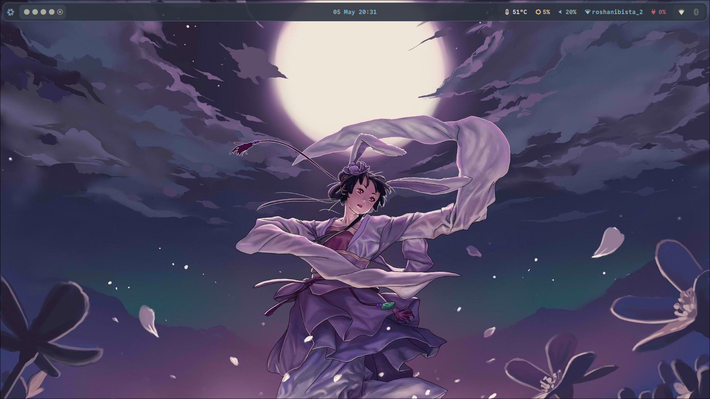
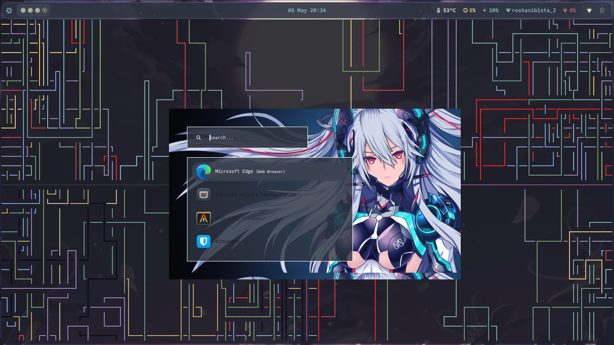
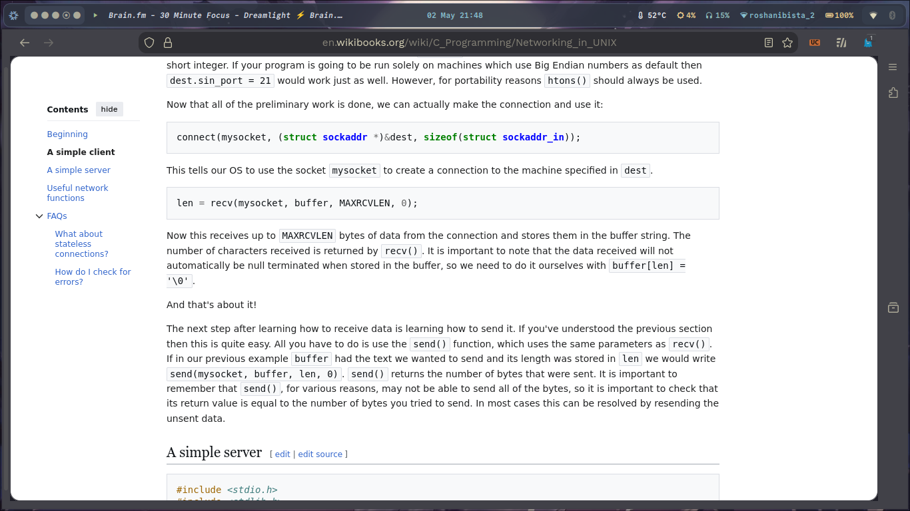
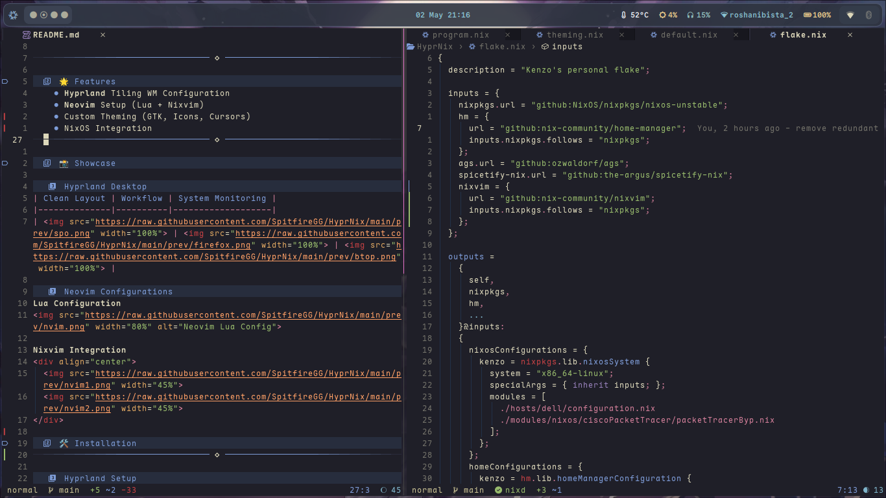
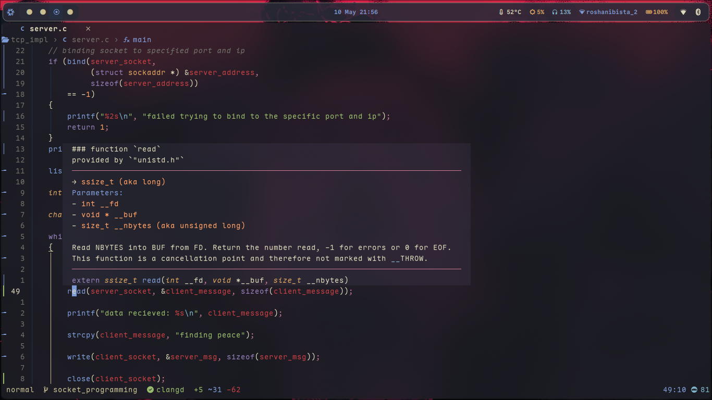

<h1 align="center">✨ HyprNix Dotfiles ✨</h1>
<p align="center">
  <i>Aesthetic and Declarative Hyprland + Neovim Configuration for NixOS</i>
</p>

<div align="center">

  
  
  
  

</div>

<div align="center">
  
</div>

---

## ✨ Overview

This repository contains my personal NixOS configuration, utilizing Nix flakes and Home Manager to create a reproducible and declarative desktop environment centered around the Hyprland Wayland compositor and Neovim. The goal is a clean, aesthetic, and highly functional setup managed entirely by Nix.

---

## 📸 Showcase

Visual examples of the configuration.

### Hyprland Desktop
| Home | Terminal with tmux | Browsing  |
|--------------|----------|-------------------|
|  |  |  |

### Neovim
Configured declaratively using Nixvim, with advanced LSP support (including `nixd` for Nix files) and `nvim-cmp`.

<div align="center">
  
  
</div>

---

## 🛠 Installation & Usage

This configuration is managed by Nix flakes. It's not a traditional dotfile setup.

1.  **Clone:** Clone this repository to a location like `~/.config/nixos`.
2.  **Configure Flake:** Edit `flake.nix` to include your machine's hostname under `nixosConfigurations` and your username under `homeConfigurations`, pointing to the correct files (likely under `hosts/` and `users/`).
3.  **Prepare Host:** Copy one of the example host directories (e.g., `hosts/dell`) to `hosts/<your-hostname>`. Update `hardware-configuration.nix` and `configuration.nix` for your specific machine and desired users.
4.  **Prepare User:** Copy one of the example user directories (e.g., `users/kenzo`) to `users/<your-username>`. Update `home.nix` for your specific user needs.
5.  **Apply:** From the repository root, run `sudo nixos-rebuild switch --flake .#<your-hostname>`.

---

## 🧠 Configuration Structure

The configuration is organized to be modular and easy to navigate:

```
.
├── assets/               # Screenshots and media for the README
├── flake.lock            # Locked dependencies
├── flake.nix             # The main entry point: defines inputs, hosts, and users.
├── hosts/                # Contains configuration files for each *machine*.
│   └── <hostname>/       # e.g., dell/, exodus/
│       ├── configuration.nix  # Imports common modules, sets machine-specific options, and links to user configs.
│       └── hardware-configuration.nix # Describes the machine's hardware (usually generated).
├── modules/              # Reusable configuration chunks (the core of the setup).
│   ├── nixos/            # Modules for the NixOS system layer (services, boot, networking, desktop setup).
│   │   └── system/, desktop/, programs/, misc/... # Organized by concern.
│   └── home-manager/     # Modules for the Home Manager user layer (programs, dotfiles, themes).
│       └── programs/, user/...       # Organized by concern (e.g., nvim, hyprland, themes, colors).
├── users/                # Contains configuration files for each *user profile*.
│   └── <username>/       # e.g., kenzo/
│       └── home.nix           # Imports common Home Manager modules and sets user-specific overrides.
├── pkgs/                 # Definitions for custom packages.
│   └── default.nix
├── overlays/             # Overlays to modify existing packages from Nixpkgs.
│   └── default.nix
├── files/                # (Recommended Addition) Directory for static configuration files (if any) that aren't fully Nixified but managed by Home Manager/NixOS. e.g., scripts, static dotfiles, config snippets.
└── README.md             # This file!
```

**NOTE** : I haven't written hyprland and other utilities configuration through nix, not all the people use nixos as daily drivers, I have configured them inside the .config folder like any other distros, to make it accessible for all types of users to use the configuration.

**How it Works:**

1.  **`flake.nix`** tells Nix where to find the configurations for your specific machines (`hosts/`) and users (`users/`).
2.  A machine's **`hosts/<hostname>/configuration.nix`** pulls together:
    *   Its specific hardware configuration.
    *   Reusable **NixOS modules** from `modules/nixos/` (e.g., enabling systemd services, setting up networking, configuring the display manager).
    *   The Home Manager system module, which in turn activates the configuration for a specific user profile defined in **`users/<username>/home.nix`**.
3.  A user's **`users/<username>/home.nix`** pulls together:
    *   Reusable **Home Manager modules** from `modules/home-manager/` (e.g., configuring specific programs like Neovim or Hyprland, managing dotfiles, applying themes).
    *   Any user-specific overrides or settings not handled by the common modules.
4.  **`modules/`** contain the actual configurations for programs and system features. These modules are designed to be imported by any host or user configuration, promoting reusability.
5.  **`files/`** (if added) is where static files referenced by your modules (like a custom `init.lua` for Neovim if not using Nixvim exclusively, or config files for programs not fully supported by Home Manager modules) would live. They are then linked or included by the relevant modules.

---

## ❤️ Credits & Inspiration

*   Thanks to the NixOS, Home Manager, Hyprland, Neovim, and Nixvim communities.
*   Inspired by other dotfile configurations.

---

<div align="center"> <br> <i>If you like the config, consider starring the repo!</i> </div>
